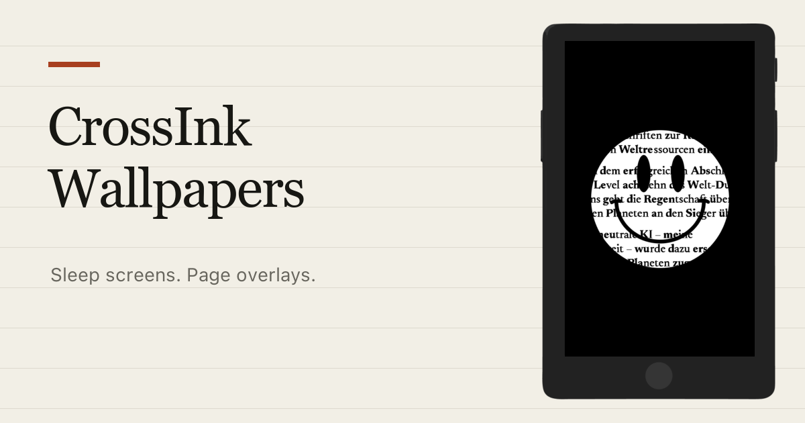
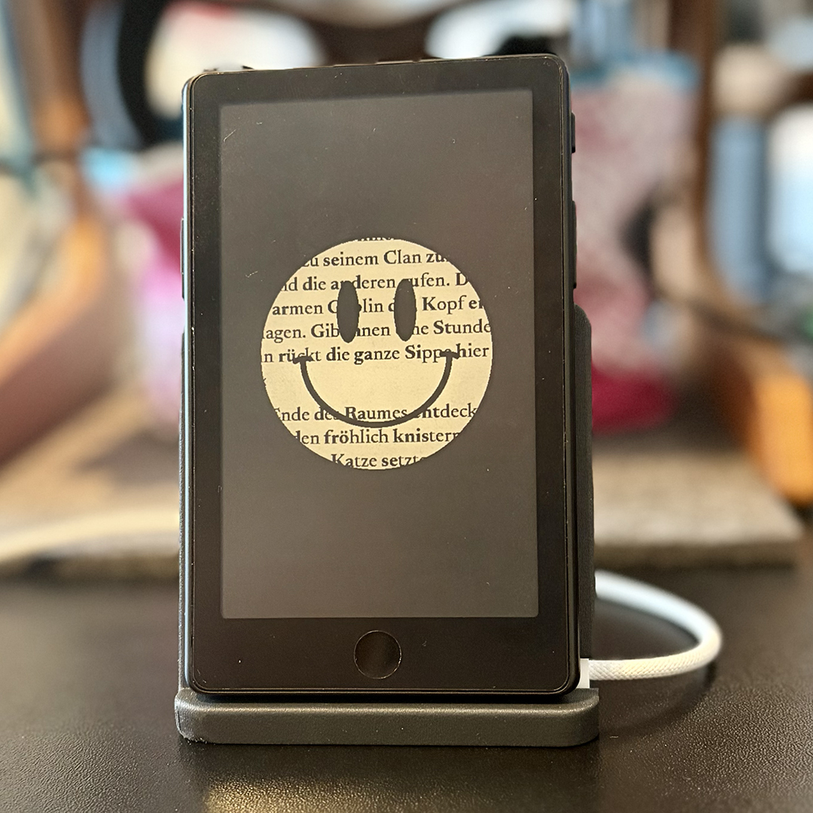

# CrossInk Wallpapers

**[Open the gallery →](https://mylatestwork.github.io/crossink-wallpapers/)**



I’m building this growing collection for the quiet moment after the last page.

Simple, useful symbols prepared for CrossInk in two formats: full-screen Custom sleep screens and transparent Page Overlays. Both fit the Xteink X4 and X4 Pro at their native **480 × 800 px** resolution.

Browse every design in the lightweight gallery, or download a ready-to-copy ZIP and go straight back to reading.

Made by [My Latest Work](https://mylatestwork.net/).

<p align="center">
  
</p>

Final transparent Custom PNG masters are preserved in [`source/custom-png`](source/custom-png); the published Custom files are flattened onto white and exported as uncompressed 24-bit BMPs.

Each mode is numbered independently. Descriptive filenames such as `custom-001-world.bmp` and `overlay-002-star.png` keep the gallery, individual downloads, and ZIP contents easy to identify. Matching numbers do not generally indicate matching motifs. The current release keeps both collections at the same consecutive, even file count.

> [!IMPORTANT]
> CrossInk uses the same sleep-image folder for both modes. Do **not** merge the Custom and Page Overlay ZIPs. Install only the pack for the mode you currently use.

## Download and install

GitHub Releases contain two ready-to-copy archives:

- `CrossInk-Custom-X4.zip` — full-screen BMP artwork for **Settings → Display → Sleep Screen → Custom**
- `CrossInk-Page-Overlays-X4.zip` — transparent PNG artwork for **Settings → Display → Sleep Screen → Page Overlay**

Each ZIP contains a `.sleep` directory at its root.

1. Back up or remove the existing `.sleep` directory on the SD card.
2. Extract the selected ZIP.
3. Copy its `.sleep` directory to the root of the SD card.
4. Select the matching Sleep Screen mode in CrossInk.

If `.sleep` is hidden on macOS, press <kbd>Command</kbd> + <kbd>Shift</kbd> + <kbd>.</kbd> in Finder.

### Keeping both packs on one SD card

CrossInk can use a preferred sleep-image folder selected from its file browser. You may keep the files in separate visible directories such as `/sleep-custom` and `/sleep-overlays`, then select the appropriate directory when switching modes. The default release ZIPs intentionally use `.sleep` for the simplest installation.

## Contents

```text
assets/x4/custom/         12 numbered and named full-screen BMP sleep images
assets/x4/page-overlays/  12 numbered and named transparent PNG overlays
catalog/packs.json        gallery pack metadata
source/custom-png/        named transparent PNG masters for the Custom collection
scripts/release.py        validation and deterministic ZIP builder
scripts/build_site.py     static gallery and thumbnail builder
site/                     gallery source files
```

Custom mode reads BMP files. Page Overlay mode can read BMP and PNG files, so the Custom BMP pack can technically be selected there too: white pixels leave the page unchanged while non-white pixels are drawn in black. The reverse does not work—transparent Overlay PNGs must first be converted to BMP before Custom mode can use them. For PNG, CrossInk treats alpha values below 128 as transparent and does not perform soft alpha blending; hard-edged, high-contrast artwork gives the most predictable result.

## Rebuilding the packs

Python 3 is the only build dependency:

```bash
python3 scripts/release.py check
python3 scripts/release.py build
```

The build command writes both archives and a checksum manifest to `dist/`. Validation checks dimensions, file headers, compression, transparency, consecutive numbering, and equal even collection sizes before packaging.

### Building the gallery

The gallery also uses only Python 3:

```bash
python3 scripts/build_site.py
python3 -m http.server 4173 --directory site-dist
```

Open `http://localhost:4173/` to view it. The build creates lightweight PNG thumbnails for the Custom BMP artwork, copies the original individual downloads, and embeds the current release ZIPs in `site-dist/`.

The manual **Deploy gallery to GitHub Pages** workflow validates and rebuilds everything before publishing. Enable GitHub Pages with **GitHub Actions** as its source, then run the workflow from the Actions tab whenever a release is ready.

### Artwork workflow

1. Edit the 480 × 800 frames in the author’s working Figma file.
2. Export transparent PNGs for Page Overlay.
3. For Custom mode, flatten transparency onto white and export an uncompressed 24-bit BMP. [Wallpaper Converter](https://wallpaperconverter.jakegreen.dev/) can do this with the X4 480 × 800 target, white background, grayscale enabled, and 24-bit output. The equivalent ImageMagick conversion used for the current files is `magick input.png -background white -alpha remove -alpha off -type TrueColor -compress none BMP3:output.bmp`.
4. Run the validator and inspect both collections in the gallery before releasing.

## Compatibility

The pack targets CrossInk's X4/X4 Pro 480 × 800 display path and was checked against the CrossInk implementation available on 31 August 2026. X4 Pro firmware support was still published as a release candidate at that time, so re-run the validation and device smoke test when updating CrossInk.

See [`COMPATIBILITY.md`](COMPATIBILITY.md) for the pinned upstream revision and the file-selection behavior used to build these packs. CrossPoint is intentionally outside this repository's scope.

This is an unofficial community artwork pack and is not affiliated with CrossInk, CrossPoint Reader, Xteink, or the Wallpaper Converter author.

## Artwork credits

The released symbols include adaptations of [Shapes, Symbols & Icons - Vol. 1](https://www.figma.com/community/file/1219674796615198415/shapes-symbols-icons-vol-1) and [Shapes, Symbols & Icons - Vol. 2](https://www.figma.com/community/file/1446631459390076153/shapes-symbols-icons-vol-2) by Counterfeit. Both source files are licensed under [CC BY 4.0](https://creativecommons.org/licenses/by/4.0/). Selected shapes were resized, repositioned, recolored, converted into monochrome masks, and exported for CrossInk at 480 × 800 px.

## License

The released wallpaper artwork, its source PNG masters, and repository-specific preview artwork are licensed by [My Latest Work](https://mylatestwork.net/) under [CC BY 4.0](https://creativecommons.org/licenses/by/4.0/). Adapted Counterfeit source shapes remain attributed under the same license. The official CrossInk logo is excluded from this license grant. Full details are recorded in [`LICENSE-ASSETS`](LICENSE-ASSETS).

The release scripts and documentation are licensed under the MIT License; see [`LICENSE-CODE`](LICENSE-CODE).

Artwork and conversion provenance are recorded in [`SOURCES.md`](SOURCES.md).
